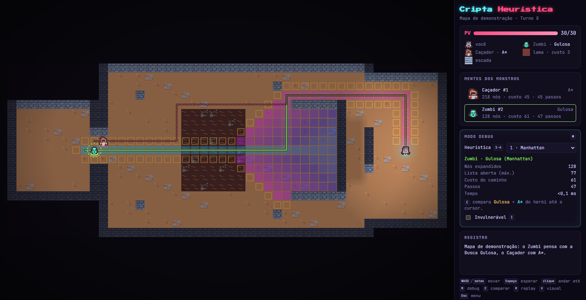
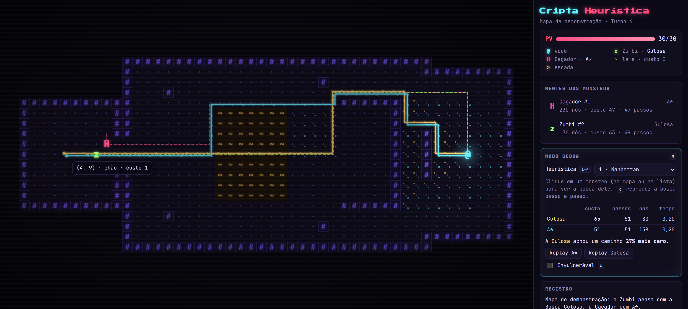

# Cripta Heurística

Roguelike para navegador que compara **Busca Gulosa** e **A\*** no planejamento de caminhos de inimigos.
Projeto Prático de **Sistemas Inteligentes** (IFPE Campus Garanhuns) — Dynylson Júnior e Gabriel de Carvalho.

- O **Zumbi** (`z`) persegue o herói com a **Busca Gulosa**: vai pelo caminho que *parece* mais curto.
- O **Caçador** (`H`) usa **A\***: vai pelo caminho que *é* mais barato.
- A **lama** (`~`) custa 3 (o chão custa 1), então a diferença entre os dois aparece na jogabilidade.





## Como rodar

Requisitos: Node.js 20+. Para gerar o PDF do relatório, Google Chrome ou Microsoft Edge instalado.

```bash
npm install
npm run dev        # jogo em http://localhost:5173 (benchmark em /bench.html)
npm test           # 15 testes automatizados (Vitest)
npm run bench      # benchmark completo (100 seeds × 5 pares) → results/
npm run report     # relatório → report/Relatorio-Cripta-Heuristica.pdf
npm run build      # versão estática em dist/
```

## Controles

| Tecla | Ação |
| --- | --- |
| `WASD` / setas | mover / atacar |
| `Espaço` | esperar um turno |
| clique | andar até o tile (A\*) · no modo debug, selecionar monstro |
| `M` ou `Tab` | modo debug (caminhos, mapa de calor, g/h/f no tooltip) |
| `C` | comparar Gulosa × A\* do herói até o cursor |
| `R` / `Shift+R` | replay passo a passo da busca (A\* / Gulosa na comparação) |
| `P` | pausar/continuar o replay |
| `1`–`4` | heurística: Manhattan, Euclidiana, Zero (Dijkstra), 2×Manhattan |
| `I` | invulnerável (útil na apresentação) |
| `V` | alterna o visual: pixel art ↔ glifos neon |
| `Esc` | fecha replay/comparação, depois abre o menu |

## Onde está cada coisa

```
src/core/         lógica pura, sem interface
  grid.ts         estados, ações e custos (chão 1, lama 3)
  heuristics.ts   Manhattan, Euclidiana, Zero, 2×Manhattan
  priorityQueue.ts heap binário (lista aberta) com desempate determinístico
  search.ts       ★ Busca Gulosa e A* (mesma função, muda só f(n))
  dungeon.ts      gerador procedural: salas + árvore geradora mínima + ciclos + lama
  demoMap.ts      mapa desenhado à mão para a apresentação
src/game/         jogo: regras por turnos, renderização, modo debug, painel
src/bench/        cenários, runner (Node e navegador), gráficos
tests/            testes (A* = Dijkstra em 500 grids aleatórios, etc.)
report/           modelo do relatório, figuras e PDF gerado
results/          saída do benchmark (JSON + CSV)
docs/             guia de estudo, roteiro da apresentação e prompt para os slides
```

## Créditos

Sprites e texturas: [Tiny Dungeon](https://kenney.nl/assets/tiny-dungeon), de Kenney (licença CC0), em
`src/assets/`. O visual alternativo em glifos neon é desenhado em código.
